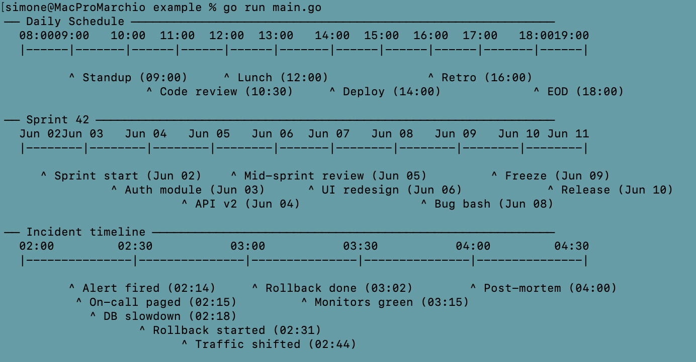

# termline

Go library that renders a horizontal ASCII timeline from a list of timestamped events.



```
go get github.com/marchiosim/termline
```

## Usage

```go
import (
    "fmt"
    "time"
    "github.com/marchiosim/termline"
)

func main() {
    t := func(s string) time.Time {
        v, _ := time.Parse("15:04", s)
        return v
    }

    events := []termline.Event{
        {Label: "deploy",     At: t("09:00")},
        {Label: "smoke test", At: t("09:15")},
        {Label: "rollback",   At: t("09:45")},
    }

    fmt.Println(termline.RenderTimeline(
        events,
        t("09:00"), t("10:00"),
        termline.Options{
            Width:     60,
            TickEvery: 15 * time.Minute,
        },
    ))
}
```

```
09:00        09:15          09:30          09:45        10:00
|--------------|--------------|--------------|--------------|

^ deploy (09:00)                             ^ rollback (09:45)
               ^ smoke test (09:15)
```

Each `^` marker is positioned at the column that corresponds exactly to the event's timestamp. Events share a row whenever their labels fit without overlapping; a new row is added only when necessary.

## API

### `RenderTimeline`

```go
func RenderTimeline(events []Event, start, end time.Time, opt Options) string
```

### `Event`

| Field   | Description                                                               |
|---------|---------------------------------------------------------------------------|
| `Label` | Text shown next to the `^` marker                                         |
| `At`    | Timestamp that determines the horizontal position                         |
| `Depth` | Sort priority (lower = placed first); `0` means order by time only        |

### `Options`

| Field        | Default   | Description                                    |
|--------------|-----------|------------------------------------------------|
| `Width`      | `100`     | Total width of the axis in characters          |
| `LeftMargin` | `0`       | Spaces prepended to every line                 |
| `TickEvery`  | `1h`      | Interval between tick marks on the axis        |
| `TimeFormat` | `"15:04"` | Go time format used for labels and event times |

## Examples

### Depth grouping

`Depth` controls sort priority, which determines row assignment order — useful to keep related events visually grouped:

```go
events := []termline.Event{
    {Label: "job A start", At: t("08:00"), Depth: 1},
    {Label: "job A end",   At: t("08:40"), Depth: 1},
    {Label: "job B start", At: t("08:10"), Depth: 2},
    {Label: "job B end",   At: t("08:55"), Depth: 2},
}
```

```
08:00        08:15          08:30          08:45        09:00
|--------------|--------------|--------------|--------------|

^ job A start (08:00)                   ^ job A end (08:40)
          ^ job B start (08:10)                        ^ job B end (08:55)
```

### Left margin

```go
termline.Options{Width: 60, TickEvery: 15 * time.Minute, LeftMargin: 4}
```

```
    12:00        12:15          12:30          12:45        13:00
    |--------------|--------------|--------------|--------------|

    ^ start (12:00)     ^ peak (12:20)           ^ end (12:45)
```

### Dense timeline (30-min ticks, width 100)

```
   06:30  07:00 07:30 08:00  08:30 09:00  09:30 10:00 10:30  11:00 11:30  12:00 12:30 13:00  13:30
|----|------|-----|-----|------|-----|------|-----|-----|------|-----|------|-----|-----|------|----|

^ mes start (06:05)                 ^ event C (08:53)  ^ event D (10:23)    ^ event G (12:04) ^ srt end (13:29)
      ^ srt start (06:31)                                 ^ event E (10:36)                   ^ mes end (13:29)
      ^ srt start +1 (06:32)                                ^ event F (10:49)
                 ^ event A (07:23)
                  ^ event B (07:28)
```
